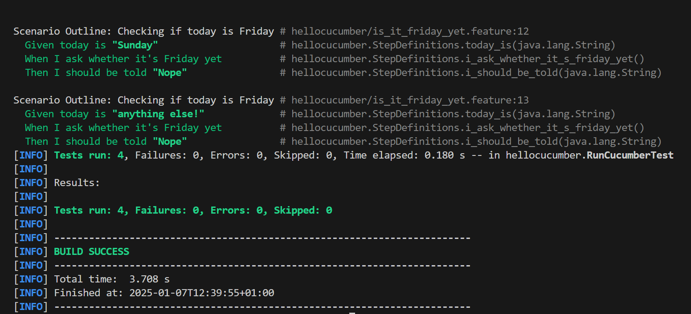
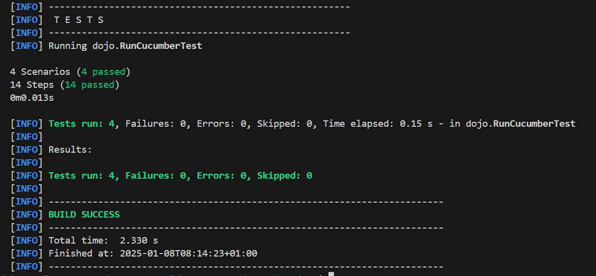

= R5.A.08 -- Dépôt pour les TPs
:icons: font

Ce dépôt concerne les rendus de mailto:bernat.soldevila-rivas@etu.univ-tlse2.fr[Bernat SOLDEVILA RIVAS].

== TP1

.TP1
[source,java]
---
Feature: Is it Friday yet?
  Everybody wants to know when it's Friday
  Scenario Outline: Checking if today is Friday
    Given today is "<day>"
    When I ask whether it's Friday yet
    Then I should be told "<answer>"
    Examples:
      | day            | answer |
      | Friday         | TGIF   |
      | Sunday         | Nope   |
      | anything else! | Nope   |

---

.Résultat d'éxecution

== TP2

.TP2
[source,java]

package dojo;
import java.util.ArrayList;
import java.util.List;
public class Order {
    private String owner;
    private String target;
    private List<String> cocktails;
    private String message;
    public Order() {
        this.cocktails = new ArrayList<>();
    }
    public void declareOwner(String name) {
        this.owner = name;
    }
    public void declareTarget(String name) {
        this.target = name;
    }
    public void addMessage(String msg) {
        this.message = msg;
    }
    public List<String> getCocktails() {
        return cocktails;
    }
    public String generateTicket() {
        StringBuilder ticket = new StringBuilder();
        ticket.append("From ").append(owner).append(" to ").append(target).append(": ");
        if (message != null && !message.isEmpty()) {
            ticket.append(message);
        }
        return ticket.toString();
    }
    public void addCocktail(String cocktail) {
        this.cocktails.add(cocktail);
    }
}

.Résultat d'éxecution

== TP 4

:toc: right
:backend: html5
:doctitle: Living Documentation
:doctype: book
:icons: font
:!numbered:
:sectanchors:
:sectlink:
:docinfo:
:source-highlighter: highlightjs
:toclevels: 3
:hardbreaks:
:chapter-label: Chapter
:version-label: Version

= *Living Documentation*

== *Summary*
[cols="12*^m", options="header,footer"]
|===
3+|Scenarios 7+|Steps 2+|Features: 1

|[green]#*Passed*#
|[red]#*Failed*#
|Total
|[green]#*Passed*#
|[red]#*Failed*#
|[purple]#*Skipped*#
|[maroon]#*Pending*#
|[yellow]#*Undefined*#
|[blue]#*Missing*#
|Total
|Duration
|Status

12+^|*<<Cocktail-Ordering>>*
|4
|0
|4
|14
|0
|0
|0
|0
|0
|14
|001ms
|[green]#*passed*#
12+^|*Totals*
|4|0|4|14|0|0|0|0|0|14 2+|001ms
|===

== *Features*

[[Cocktail-Ordering, Cocktail Ordering]]
=== *Cocktail Ordering*

ifndef::backend-pdf[]
minmax::Cocktail-Ordering[]
endif::[]
****
As Romeo, I want to offer a drink to Juliette so that we can discuss together.
****

==== Scenario Outline: Creating an empty order

==========
Given ::
Romeo who wants to buy a drink icon:thumbs-up[role="green",title="Passed"] [small right]#(000ms)#
When ::
an order is declared for Juliette icon:thumbs-up[role="green",title="Passed"] [small right]#(000ms)#
Then ::
there is 0 cocktails in the order icon:thumbs-up[role="green",title="Passed"] [small right]#(000ms)#
==========

==== Scenario Outline: Creating an empty order

==========
Given ::
Tom who wants to buy a drink icon:thumbs-up[role="green",title="Passed"] [small right]#(000ms)#
When ::
an order is declared for Jerry icon:thumbs-up[role="green",title="Passed"] [small right]#(000ms)#
Then ::
there is 0 cocktails in the order icon:thumbs-up[role="green",title="Passed"] [small right]#(000ms)#
==========

==== Scenario Outline: Sending a message with an order

==========
Given ::
Romeo who wants to buy a drink icon:thumbs-up[role="green",title="Passed"] [small right]#(000ms)#
When ::
an order is declared for Juliette icon:thumbs-up[role="green",title="Passed"] [small right]#(000ms)#
And ::
a message saying "Wanna chat?" is added icon:thumbs-up[role="green",title="Passed"] [small right]#(000ms)#
Then ::
the ticket must say "From Romeo to Juliette: Wanna chat?" icon:thumbs-up[role="green",title="Passed"] [small right]#(000ms)#
==========

==== Scenario Outline: Sending a message with an order

==========
Given ::
Tom who wants to buy a drink icon:thumbs-up[role="green",title="Passed"] [small right]#(000ms)#
When ::
an order is declared for Jerry icon:thumbs-up[role="green",title="Passed"] [small right]#(000ms)#
And ::
a message saying "Hei!" is added icon:thumbs-up[role="green",title="Passed"] [small right]#(000ms)#
Then ::
the ticket must say "From Tom to Jerry: Hei!" icon:thumbs-up[role="green",title="Passed"] [small right]#(000ms)#
==========

== Je n'ai pas reussi a build le projet de serenity:

.TP2
[source,bash]
Downloaded from central: https://repo.maven.apache.org/maven2/org/assertj/assertj-core/3.24.2/assertj-core-3.24.2.jar (1.3 MB at 174 kB/s)
Downloaded from central: https://repo.maven.apache.org/maven2/net/bytebuddy/byte-buddy/1.12.21/byte-buddy-1.12.21.jar (3.9 MB at 494 kB/s)
[INFO] 
[INFO] --- clean:3.2.0:clean (default-clean) @ serenity-junit-screenplay-starter ---
[INFO] 
[INFO] --- resources:3.3.0:resources (default-resources) @ serenity-junit-screenplay-starter ---
[INFO] skip non existing resourceDirectory /home/bernas/serenity-junit-screenplay-starter/src/main/resources
[INFO] 
[INFO] --- compiler:3.11.0:compile (default-compile) @ serenity-junit-screenplay-starter ---
[INFO] Changes detected - recompiling the module! :dependency
[INFO] 
[INFO] --- resources:3.3.0:testResources (default-testResources) @ serenity-junit-screenplay-starter ---
[INFO] Copying 2 resources
[INFO] 
[INFO] --- compiler:3.11.0:testCompile (default-testCompile) @ serenity-junit-screenplay-starter ---
[INFO] Changes detected - recompiling the module! :dependency
[INFO] Compiling 4 source files with javac [debug target 16] to target/test-classes
[INFO] ------------------------------------------------------------------------
[INFO] BUILD FAILURE
[INFO] ------------------------------------------------------------------------
[INFO] Total time:  52.805 s
[INFO] Finished at: 2025-01-10T16:00:39+01:00
[INFO] ------------------------------------------------------------------------
[ERROR] Failed to execute goal org.apache.maven.plugins:maven-compiler-plugin:3.11.0:testCompile (default-testCompile) on project serenity-junit-screenplay-starter: Fatal error compiling: error: invalid target release: 16 -> [Help 1]
[ERROR] 
[ERROR] To see the full stack trace of the errors, re-run Maven with the -e switch.
[ERROR] Re-run Maven using the -X switch to enable full debug logging.
[ERROR] 
[ERROR] For more information about the errors and possible solutions, please read the following articles:
[ERROR] [Help 1] http://cwiki.apache.org/confluence/display/MAVEN/MojoExecutionException